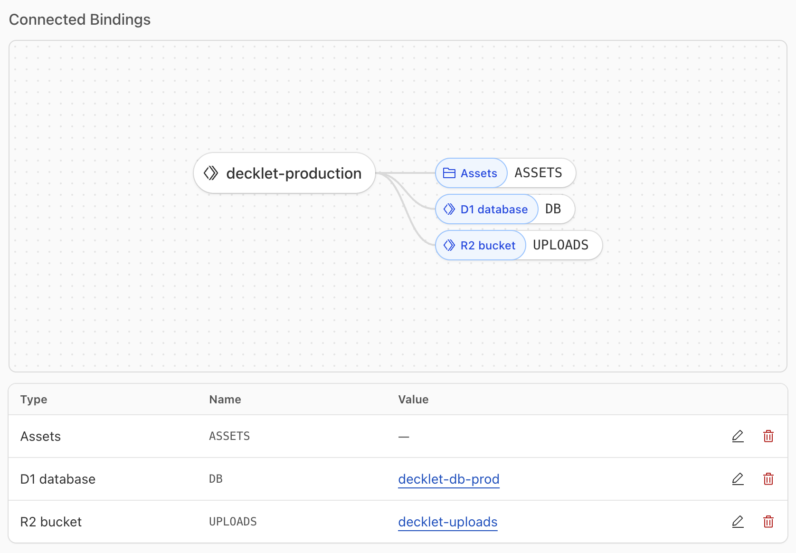

+++
title = "Cloudflare D1 入門ノート"
date = 2025-09-20
updated = 2025-09-20
draft = false
taxonomies = { tags=["Cloudflare D1", "Database"], categories=["Cloudflare"] }
[extra]
author = "etak64n"
hero = "/images/hero/placeholder.svg"
toc = true
+++

## Cloudflare D1 入門ノート

### Cloudflare D1 とは？

Cloudflare D1 は、Cloudflare が提供するマネージドサービスで、サーバーレスのリレーショナルデータベースです。
SQLite をベースにしています。

2022年5月11日に Cloudflare D1 がリリースされました。
Today, we're excited to announce D1, our first SQL database.


{{ link(url="https://developers.cloudflare.com/d1/", title="Overview · Cloudflare D1 docs") }}

{{ link(url="https://www.cloudflare.com/developer-platform/products/d1/", title="Build a natively serverless SQL database with Cloudflare D1 | Cloudflare") }}

### Cloudflare D1 の基本
Cloudflare D1 はリソースとして作成することができます。

**作成方法**
1. `wrangler` の `wrangler d1 create` で作成する 
Creates a new D1 database, and provides the binding and UUID that you will put in your Wrangler file.
`wrangler d1 create <DATABASE_NAME> [OPTIONS]`

2. Cloudflare Dashboard の D1 SQL database から作成
3. REST API で作成する ( `POST /accounts/{account_id}/d1/database` )

**クエリの実行方法**
作成された Cloudflare D1 に対して、クエリを実行する方法は以下の4種類あります。
1. Cloudflare Dashboard の D1 コンソールから実行
2. `wrangler` の `wrangler d1 execute` で実行
3. Cloudflare HTTP API (`POST /accounts/{account_id}/d1/database/{database_id}/query`) で実行 
`POST /accounts/{account_id}/d1/database/{database_id}/query` を使って D1 にリクエストを送ります。

1. Workers に紐付け(binding)して Workers Binding API で実行 
Workers ランタイムから直接 D1 を操作するための JavaScript API 群です。


**注意点**
1. `wrangler d1 execute` も REST API 扱いです 
D1 Wrangler commands use REST APIs to interact with the control plane. This page lists the Wrangler commands for D1.

1. REST API での実行は、主に管理用途として位置付けられているため、Workers Binding API での使用がおすすめ 
D1's built-in REST API is best suited for administrative use as the global Cloudflare API rate limit applies.

1. 外部から実行する場合も Proxy Worker を用意して、外部 -> Proxy Worker -> D1 という実行がいいようです 
To access a D1 database outside of a Worker project, you need to create an API using a Worker. Your application can then securely interact with this API to run D1 queries.


### Cloudflare Worker と D1 の Binding について

以下の図では、`decklet-production` という Cloudflare Worker に対して `Assets`、`D1 database`、`R2 bucket` が binding されている、という図になります。



binding すると、Cloudflare Worker から D1 database に対して Workers Binding API で実行することができます。

### リードレプリカ
Cloudflare D1 にはリードレプリカの機能があります。

**Cloudflare D1 のリードレプリカの特徴**
* プライマリ DB の読み取り専用コピーを世界各リージョンに非同期で複製する
  * 読み取りクエリを近い場所で処理してレイテンシ低減・スループット向上を狙う
* 書き込みは常にプライマリに流れます
* 対応リージョンすべてに自動で作成されます
* 使うには “Sessions API” が必須です
  * これを使わないと、有効化しても全クエリはプライマリで実行されます
* 追加料金なし
  * rows_read / rows_written の使用量課金は発生する
* 無効化には最大で24時間かかる

**有効化する方法**
1. D1 database で有効化
　Dashboard：D1データベース → Settings → Enable Read Replication
　REST API：PUT /accounts/{account_id}/d1/database/{database_id} に {"read_replication":{"mode":"auto"}}。
2. Workerで Sessions API を使う

```js
export default {
  async fetch(req, env) {
    // 1. セッションを開始（最初は最新が不要なら “first-unconstrained” = 既定）
    const session = env.DB.withSession(); // = "first-unconstrained"
    // 最新が必須なら: env.DB.withSession("first-primary")

    // 2. 以降のクエリはこの session で実行（順序一貫性が保たれる）
    const result = await session.prepare("SELECT * FROM items WHERE id=?").bind(123).all();

    // 3. 後続リクエストに継続させるならブックマークを返す
    const res = Response.json(result);
    res.headers.set("x-d1-bookmark", session.getBookmark() ?? "");
    return res;
  }
}
```

### Cloudflare D1 のキャッシュ戦略
**Cloudflare D1 自体にはキャッシュの機能がありません。**

Worker の機能を使うことになります。

1. Cloudflare Worker 内で Cache API を呼び出す
2. Cloudflare Edge CDN キャッシュを有効にする

{{ link(url="https://developers.cloudflare.com/workers/reference/how-the-cache-works/", title="How the Cache works · Cloudflare Workers docs") }}

**Cloudflare Worker の Cache**

1. 事前に cache.put で HTTP GET リクエストと HTTP レスポンスのキーを保存しておく
2. cache.match で HTTP GET リクエストに対して、キャッシュが保存されているか確認する
3. あれば、キャッシュから HTTP リクエストを返す

```
Client ─→ Worker
          ├─(1) cache.match(req)  ← ここでHITなら即返す
          ├─(2) env.DB（D1 Binding）でSQL実行 ← これはHTTPではない
          ├─(3) JSON/HTMLを組み立てて Response を作る
          └─(4) cache.put(req, response) で保存 → Clientへ返す
```

* データの保存先は、cache.put を実施したデータセンター(POP)
  * 別の POP にアクセスした場合は、キャッシュ機能は機能しない

**Cloudflare Edge CDN Cache Rules**

Cloudflare Edge CDN Cache Rules は以下の優先度で設定項目を参照します。
1. `fetch(..., { cf })` の　`cf` 設定
2. CacheRules の設定

`fetch()` や CacheRules は、Worker が取りに行く上流の fetch の応答を CDN がキャッシュします。

```
Client ─→ Worker ─→ fetch(上流URL, { cf: { cacheTtl, cacheEverything, ... } })
                         ↑ この fetch の応答を CDN がキャッシュ
                    └→ Clientへ返す（キャッシュ結果）
```

### Cloudflare D1 の料金や制限

Cloudflare D1 の料金や制限は、以下の Cloudflare ドキュメントにまとまっています。

{{ link(url="https://developers.cloudflare.com/d1/platform/pricing/", title="Pricing · Cloudflare D1 docs") }}

{{ link(url="https://developers.cloudflare.com/d1/platform/limits/", title="Limits · Cloudflare D1 docs") }}

| 項目 | Worker Free | Worker Paid |
|-----| ----------- |------------|
|Cloudflare Worker| Worker Free の料金に準ずる | Worker Paid の料金に準ずる |
|クエリで行の読み込み<br>(SELECT)|5 million / day<br>超過時は当日中クエリエラー|読取 250億行/month<br>(全ての D1 database)<br>+ $0.001 / million rows|
|クエリで行の書き込み<br>(INSERT/UPDATE/DELETE)|100,000 / day<br>超過時は当日中クエリエラー|書込 5,000万行/月<br>(全ての D1 database)<br>+ $1.00 / million rows|
|ストレージサイズ<br>(テーブル + インデックス) | 合計 5GB<br>(全ての D1 database)<br>or<br>500MB | アカウント内の全ての D1 のストレージが合計 5GB まで無料<br>+ $0.75GB/月 |
|稼働時間|課金なし|課金なし|
|行のサイズ|料金影響なし|料金影響なし|
|データ転送|課金なし|課金なし|
|リードレプリカに対する読み込み|課金あり|課金あり|
|リードレプリカの追加|課金なし|課金なし|
|D1 database の個数上限|10|50,000|
|SQLクエリの実行時間|30秒|30秒|
|Time Travel の保持期間<br>(Point-in-time Recovery)|7 days|30 days|
|キャッシュ機能|なし|なし|