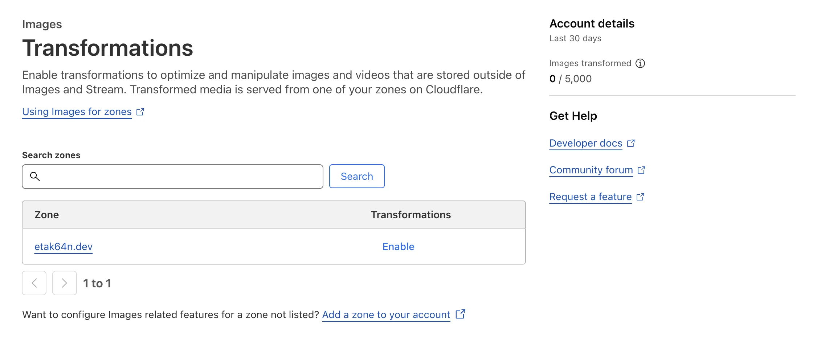
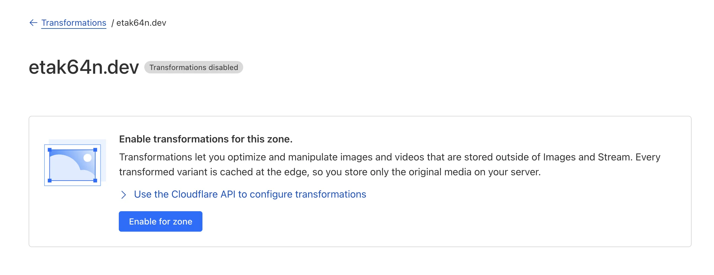
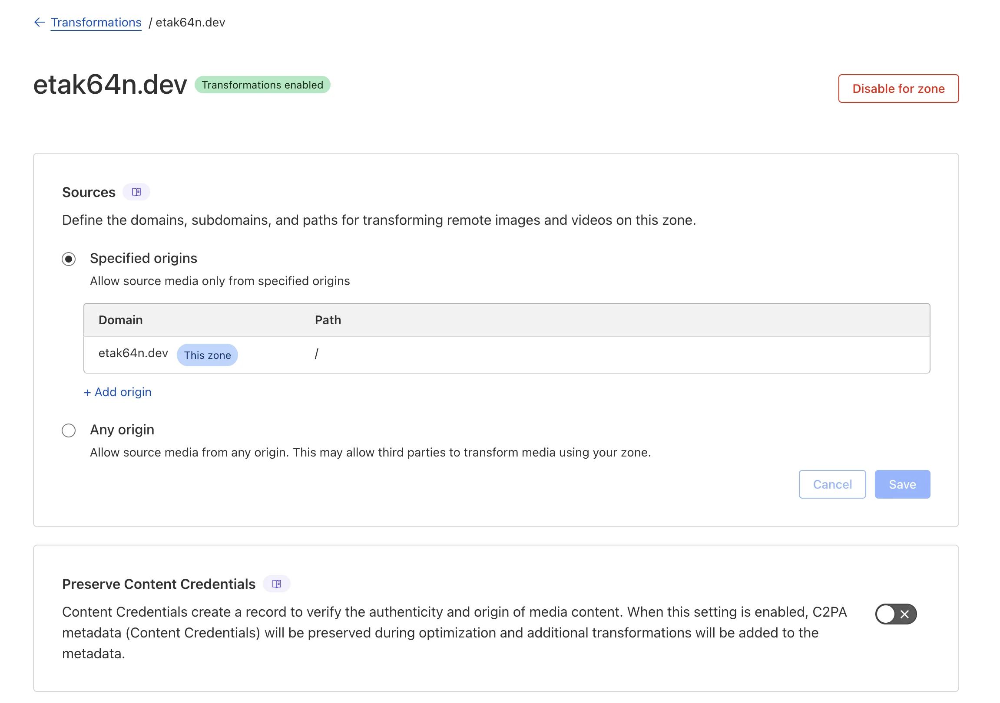
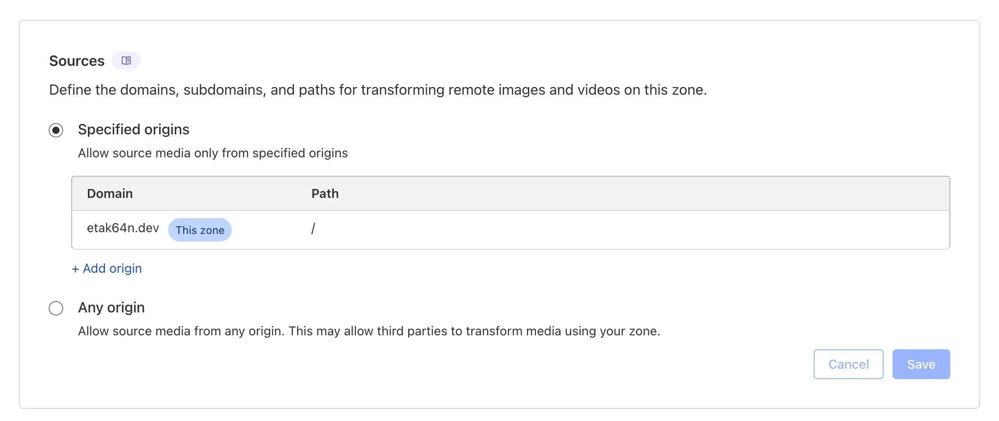
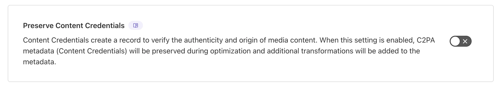

+++
title = "Cloudflare Image Transformations"
date = 2025-09-12
updated = 2025-09-12
draft = true
taxonomies = { tags=["Cloudflare Images", "Cloudflare R2"], categories=["Cloudflare"] }
math = true
[extra]
author = "etak64n"
hero = "/images/hero/placeholder.svg"
toc = true
+++

## Cloudflare Image Transformations

etak64n.dev の Transformations の項目が Enable と表示されています。
これは **まだ有効化されていない** ため、Enable が押せる状態です。

ドメインをクリックすると、**Transformations disabled** と表示されています。

有効にすると、**Transformations enabled** に変わります。

一覧の画面でも Transformations が **有効になった** ので、Disabled が押せる状態になっています。

---

## Cloudflare Image Transformations の設定項目

### Source

Cloudflare の URL 変換（例：/cdn-cgi/image/...）で、元画像/動画をどのドメインから取得して変換してよいかを制限します。

**Specified origins**
指定した送信元のみからの画像を変換します。

**Any origin**
任意の送信元
どのドメインのメディアでも変換を許可します。

注意：第三者が自分のドメイン経由で他サイトの画像変換に使う“踏み台”になり得るため、通常は非推奨です（帯域や課金の無駄遣いにつながる可能性）

具体例

自ドメイン内の画像を変換：
https://etak64n.dev/cdn-cgi/image/width=800/hero.jpg

外部ドメインの画像を変換（その外部を Sources に許可している必要あり）：
https://etak64n.dev/cdn-cgi/image/width=800/https://static.example.com/photo.jpg

### Preserve Content Credentials

C2PA（Content Credentials）という真正性・来歴メタデータを、Cloudflare の最適化・変換後も **保持（かつ変換の事実をメタデータに追記）** するかの切り替えです。

- OFF：最小サイズ重視。C2PA メタデータは保持しない場合あり。(デフォルト)
- ON：改ざん防止や来歴保持を重視する場合に有効（若干ファイルサイズが増えることがあります）。
