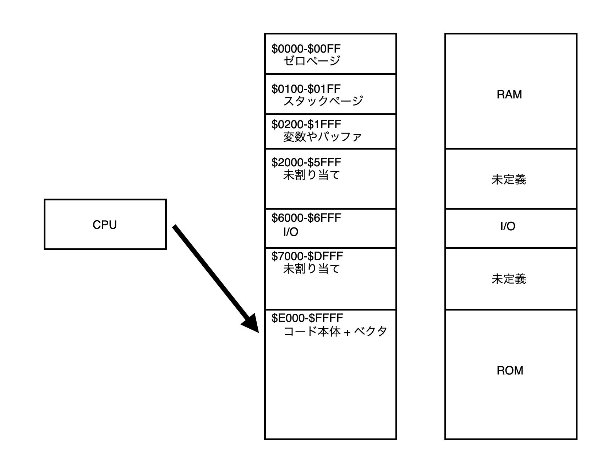

+++
title = "ファミコンを作る 02 - ファミコン CPU 解説 MOS 6502 編"
date = 2025-10-26
updated = 2025-10-26
draft = true
taxonomies = { tags=["Nintendo","Game","NES", "ファミコンを作る"], categories=["Nintendo"] }
math = true
[extra]
author = "etak64n"
hero = "/images/hero/placeholder.svg"
toc = true
+++

## ファミコンを作る 02
本記事はファミコンを作ることを目的とした記事です。
前回はファミコンの歴史について振り返りました。
今回からファミコンの CPU アーキテクチャについて深掘りしていきます。
ファミコンの CPU であるリコー製の RP2A03 (Ricoh 2A03) を理解するにあたり、ベースとなった MOS 6502 および CPU の理解が必要なため、本記事では MOS 6502 について理解を深めます。

## ファミコンの CPU
ファミコンに使用されている CPU は、リコー製の RP2A03 (Ricoh 2A03) です。
これは、任天堂とリコーが共同開発して、リコーが製造した 8 Bit CPU となります。
アメリカの MOS Technology, Inc. という半導体メーカーが作成した MOS 6502 をベースにしています。

### MOS 6502 のアーキテクチャ
MOS 6502 は、アメリカの MOS Technology が開発し、1975年に発表しました。
当時、競合の Intel 8080 や Motorola 6800 より圧倒的に安価で、8 bit CPU 普及に繋がりました。 
What if the brain of a personal computer cost less than a night out for dinner? In 1975, a group of former Motorola engineers proved it could, and in doing so, they changed computing forever. Their $25 MOS Technology 6502 processor not only powered the Apple II, Commodore PET, and Atari 2600, but also embodied a design philosophy that still echoes today in modern RISC CPUs.


MOS Technology 6502 (6502 processor) は以下の写真のように40個のピンで構成されています。

 出典：[Wikipedia](https://en.wikipedia.org/wiki/MOS_Technology_6502)

それぞれのピンの役割としては、以下の通りです。

 出典：[Wikipedia](https://en.wikipedia.org/wiki/MOS_Technology_6502)

| Signal   | Description (EN)                         | 日本語の解説                                             |
| -------- | ---------------------------------------- | -------------------------------------------------- |
| Vcc      | supply voltage (+5 V DC ± 5%, +7 V max.) | 電源入力 **+5V**（許容±5%）。+7Vは絶対最大付近。                    |
| Vss      | logical ground                           | **GND**（論理グラウンド）。                                  |
| φ0…2     | clock                                    | クロック信号。実装によって **φ0 入力／φ1・φ2 出力** などの構成。動作タイミングの基準。 |
| A0 … A15 | address bus                              | **16ビット**のアドレスバス（**$0000–$FFFF**＝64KB空間）。          |
| D0 … D7  | data bus                                 | **8ビット**双方向データバス。読み時は周辺が、書き時はCPUがドライブ。             |
| R/ W     | read/write (low on write)                | 読み書き選択。**1=Read**, **0=Write**。                    |
| RDY      | ready                                    | **LowでCPU一時停止**（ウェイト挿入／DMA等に使用）。                   |
| S.O.     | set overflow (future I/O interface)      | **V（オーバーフロー）フラグを1にする**入力（NMOS系。一般用途ではほぼ未使用）。       |
| SYNC     | sync (goes high on opcode fetch phase)   | **命令フェッチ開始サイクルでHigh**になる出力（トレース/デバッグ用）。            |
| IRQ      | interrupt request (active low)           | **マスク可能割り込み**入力（**アクティブLow**）。                     |
| NMI      | non maskable interrupt (active low)      | **マスク不可割り込み**入力（**アクティブLow**）。                     |
| RES      | reset (active low)                       | **リセット**入力（Lowで初期化、復帰時に **$FFFC/$FFFD** のベクタを読む）。  |
| N.C.     | no connection                            | **未接続**（内部に結線なし。つながない）。                            |

引用：[6502 Instruction Set](https://www.masswerk.at/6502/6502_instruction_set.html)

これらのピンは、トランジスタをオンにすることで、電圧をかける(1, HIGH)、電圧を 0 にする(0, LOW) の2つの状態を取ります。
なお、厳密には、出力トランジスタをオフにすることで電圧をかけない状況があり、実質抵抗値が無限大の Hi-Z (High-Impedance) という状態になります。この場合、電圧は不定になります。
CPU は 0 または 1 の値として読み取ってしまうため、なるべく不定状態を作らないことが重要となります。

内部の回路は以下のようになっています。

 出典：[Wikipedia](https://en.wikipedia.org/wiki/MOS_Technology_6502)

### MOS 6502 のレジスタ
レジスタは、CPU 内部の記憶素子です。
アドレス空間外で使える記憶領域で、CPU 内部に持つため、高速ですが、あまり多くのレジスタを持つことはできません。

**Registers**

| 名前     | 説明                         | ビット幅 | 備考                                 |
| ------ | -------------------------- | ---: | ---------------------------------- |
| **PC** | Program Counter（プログラムカウンタ） |   16 | 次に実行する命令の番地                        |
| **AC** | Accumulator（アキュムレータ）       |    8 | 演算やロード/ストアの中心となるレジスタ               |
| **X**  | X レジスタ                     |    8 | インデックスやループカウンタなどに使用                |
| **Y**  | Y レジスタ                     |    8 | インデックスやループカウンタなどに使用                |
| **SR** | Status Register            |    8 | NV-BDIZC の各フラグ |
| **SP** | Stack Pointer              |    8 | スタックページ **$0100–$01FF** のオフセット     |

引用：[6502 Instruction Set](https://www.masswerk.at/6502/6502_instruction_set.html)

**Status Register Flags (bit 7 → bit 0)**
| Bit |  Flag | Name              | 説明                                                               |
| --: | :---: | ----------------- | -------------------------------------------------------------------- |
|   7 | **N** | Negative          | 結果の **bit7** が 1 ならセット（負の符号ビット）。                                     |
|   6 | **V** | Overflow          | **符号付き**加減算でオーバーフローしたらセット（同符号同士の演算で結果の符号が反転した等）。                     |
|   5 | **–** | ignored           | 予約／未使用（スタックへプッシュされたコピーでは常に 1 として現れるのが通例）。                            |
|   4 | **B** | Break             | **BRK / PHP** が SR をスタックに積む時だけ 1 として現れる“擬似”ビット。ハード割り込みで積まれる SR では 0。 |
|   3 | **D** | Decimal           | **BCD（十進）モード**を有効化（`ADC/SBC` を十進演算に）。※NES の 2A03 では機能しない。            |
|   2 | **I** | Interrupt disable | **IRQ 禁止**。`SEI` で 1、`CLI` で 0。                                      |
|   1 | **Z** | Zero              | 結果が **0** ならセット。                                                     |
|   0 | **C** | Carry             | **桁上がり／借りなし**でセット。`CMP` は **A ≥ M** なら 1。                            |

引用：[6502 Instruction Set](https://www.masswerk.at/6502/6502_instruction_set.html)

Status Register の各フラグの値に応じて、オペコードの実行内容が変わります。

**Stack Page**
`$0100 - $01FF` の 256 バイトがスタック用のアドレスとして定義されています。
LIFO (Last-In, First-Out) で、スタックに push/pop して使います。

SP はページ内のオフセットだけ持っていて、実際のアドレスとしては `$0100 + SP` というイメージです。
(ビット操作で `$0100 | SP` と同じ。 `$0100` と `$00XX` の OR 演算で `$01XX` )

スタックの用途としては以下のようなものが挙げられます。
- サブルーチンの戻り先を覚えるため
- 割り込みから安全に復帰するため
- レジスタの値の一時退避
- ローカル変数や式評価の置き場所

プログラムの処理中の値を変数として保存しておきたい時にスタックとして保存するイメージとなります。

### MOS 6502 の命令セット

| Mnemonic | English                    | 日本語          | 要点（動作の核）              |
| -------- | -------------------------- | ------------ | --------------------- |
| **ADC**  | add with carry             | 加算（キャリ込み）    | A ← A + M + C         |
| **AND**  | logical AND                | 論理積          | A ← A AND M           |
| **ASL**  | arithmetic shift left      | 算術左シフト       | A/M を左1bit、落ちたbit→C   |
| **BCC**  | branch if carry clear      | キャリ=0なら分岐    | C=0 で相対分岐             |
| **BCS**  | branch if carry set        | キャリ=1なら分岐    | C=1 で相対分岐             |
| **BEQ**  | branch if equal (zero set) | ゼロ=1なら分岐     | Z=1 で分岐               |
| **BIT**  | bit test                   | ビットテスト       | A AND M を評価、Z/N/V を更新 |
| **BMI**  | branch if minus            | 負なら分岐        | N=1 で分岐               |
| **BNE**  | branch if not equal        | ゼロ=0なら分岐     | Z=0 で分岐               |
| **BPL**  | branch if plus             | 正/非負なら分岐     | N=0 で分岐               |
| **BRK**  | break / interrupt          | ブレーク         | PC/SR を push→IRQ ベクタへ |
| **BVC**  | branch if overflow clear   | OVF=0なら分岐    | V=0 で分岐               |
| **BVS**  | branch if overflow set     | OVF=1なら分岐    | V=1 で分岐               |
| **CLC**  | clear carry                | キャリクリア       | C ← 0                 |
| **CLD**  | clear decimal              | 十進モードクリア     | D ← 0（※2A03はD無効）      |
| **CLI**  | clear interrupt disable    | IRQ許可        | I ← 0                 |
| **CLV**  | clear overflow             | OVFクリア       | V ← 0                 |
| **CMP**  | compare (with A)           | 比較（Aと）       | A−M を評価→Z/N/C         |
| **CPX**  | compare X                  | 比較（Xと）       | X−M を評価→Z/N/C         |
| **CPY**  | compare Y                  | 比較（Yと）       | Y−M を評価→Z/N/C         |
| **DEC**  | decrement (memory)         | デクリメント（メモリ）  | M ← M−1               |
| **DEX**  | decrement X                | デクリメントX      | X ← X−1               |
| **DEY**  | decrement Y                | デクリメントY      | Y ← Y−1               |
| **EOR**  | exclusive OR               | 排他的論理和       | A ← A EOR M           |
| **INC**  | increment (memory)         | インクリメント（メモリ） | M ← M+1               |
| **INX**  | increment X                | インクリメントX     | X ← X+1               |
| **INY**  | increment Y                | インクリメントY     | Y ← Y+1               |
| **JMP**  | jump                       | ジャンプ         | PC ← 直/間接アドレス         |
| **JSR**  | jump to subroutine         | サブルーチン呼出     | 復帰先をpush→PC更新         |
| **LDA**  | load accumulator           | Aへロード        | A ← M                 |
| **LDX**  | load X                     | Xへロード        | X ← M                 |
| **LDY**  | load Y                     | Yへロード        | Y ← M                 |
| **LSR**  | logical shift right        | 論理右シフト       | A/M を右1bit、落ちたbit→C   |
| **NOP**  | no operation               | 何もしない        | 副作用ほぼなし               |
| **ORA**  | logical OR                 | 論理和          | A ← A OR M            |
| **PHA**  | push accumulator           | Aをプッシュ       | push A                |
| **PHP**  | push processor status      | SRをプッシュ      | push SR（B=1として積まれる）   |
| **PLA**  | pull accumulator           | Aをプル         | A ← pop               |
| **PLP**  | pull processor status      | SRをプル        | SR ← pop              |
| **ROL**  | rotate left                | 左ローテート       | (A/M,C) を左回転          |
| **ROR**  | rotate right               | 右ローテート       | (A/M,C) を右回転          |
| **RTI**  | return from interrupt      | 割り込み復帰       | SR, PC をpopして復帰       |
| **RTS**  | return from subroutine     | サブルーチン復帰     | PC ← pop+1            |
| **SBC**  | subtract with borrow       | 減算（ボロウ反転）    | A ← A − M − (1−C)     |
| **SEC**  | set carry                  | キャリセット       | C ← 1                 |
| **SED**  | set decimal                | 十進モードセット     | D ← 1（※2A03はD無効）      |
| **SEI**  | set interrupt disable      | IRQ禁止        | I ← 1                 |
| **STA**  | store accumulator          | Aをストア        | M ← A                 |
| **STX**  | store X                    | Xをストア        | M ← X                 |
| **STY**  | store Y                    | Yをストア        | M ← Y                 |
| **TAX**  | transfer A to X            | A→X          | X ← A                 |
| **TAY**  | transfer A to Y            | A→Y          | Y ← A                 |
| **TSX**  | transfer SP to X           | SP→X         | X ← SP                |
| **TXA**  | transfer X to A            | X→A          | A ← X                 |
| **TXS**  | transfer X to SP           | X→SP         | SP ← X                |
| **TYA**  | transfer Y to A            | Y→A          | A ← Y                 |

引用：[6502 Instruction Set](https://www.masswerk.at/6502/6502_instruction_set.html)

### MOS 6502 のメモリマップ

MOS 6502 はアドレスバスが A0 - A15 の16種類あり、それぞれが 0 または 1 の値を取る 16 bit となっています。
つまり、2^16 = 65536 Bytes (64KB) でアドレスを表現することができます。
16進数では、A0 - A15 の値次第で `$0000 - $FFFF` を表現することができます。

物理チップとして RAM、ROM、I/O の3種を考えた場合、A0 - A15 の値を使って、RAM、ROM、I/O の3つの空間にアドレス領域を分割します。
- `A15..A13 = 000`  => 000x_xxxx_xxxx_xxxx => `$0000 - $1FFF`
- `A15..A12 = 0110` => 0110_xxxx_xxxx_xxxx => `$6000 - $6FFF`
- `A15..A13 = 111`  => 111x_xxxx_xxxx_xxxx => `$E000 - $FFFF`

`/CS` (Chip Select) として、RAM に繋ぐ場合の信号を `/CS_RAM`、I/O に繋ぐ場合の信号を `/CS_IO`、ROM に繋ぐ場合の信号を `/CS_ROM` と定義します。

- `/CS_RAM = (A15..A13 = 000)` → $0000–$1FFF を RAM に
- `/CS_IO  = (A15..A12 = 0110)` → $6000–$6FFF を I/O に
- `/CS_ROM = (A15..A13 = 111)` → $E000–$FFFF を ROM に

これらのルールに従い、データバスを使ってデータを読み込みます。
なお、上記のいずれにも該当しない場合は、未割り当ての領域となっています。
未割り当て領域から読み込みが発生した場合、その時設定されたデータバスの値から読み込まれるが、不定なので要注意です。
未割り当て領域に書き込みが発生した場合、データバスに値を出すが書き込み先がないため、何も起きません。

**メモリマップ**

| 範囲              | 役割               | 備考                                                       |
| --------------- | ---------------- | -------------------------------------------------------- |
| **$0000–$00FF** | **ゼロページ**        | 高速アクセス用RAM。擬似レジスタ置き場に最適（ZPアドレッシングで短サイクル）                 |
| **$0100–$01FF** | **スタックページ**      | 実アドレスは $0100 \| SP（SP=8bitオフセット）。pushでSP↓／pullでSP↑    |
| **$0200–$1FFF** | 変数・バッファ          | 作業用RAM。部分デコードなら **$0000–$07FF 実体＋$0800–$1FFF ミラー**などにできる |
| **$2000–$5FFF** | 未割り当て（予約）        | 今は誰にも/CSを出さない領域。**読み=オープンバス／書き=捨て**。将来I/OやRAM/ROMを割当可    |
| **$6000–$6FFF** | **I/O**          | この設計では **/CS_IO** を落とす島。下位A0..A3等で各レジスタを選択               |
| **$7000–$DFFF** | 未割り当て（予約）        | 同上。将来の拡張用。未使用時はソフトで読まないこと                                |
| **$E000–$FFFF** | **ROM（コード＋ベクタ）** | **/CS_ROM**。ここは常にROMで見えるよう固定（ベクタが末尾にあるため必須）              |

**ベクタ**

| 範囲              | 役割              | 備考                       |
| --------------- | --------------- | ------------------------ |
| **$FFFA–$FFFB** | **NMI ベクタ**     | 16bit飛び先（**下位→上位**の順で格納） |
| **$FFFC–$FFFD** | **RESET ベクタ**   | 電源ON／リセット解除後の開始アドレス      |
| **$FFFE–$FFFF** | **IRQ/BRK ベクタ** | マスク可能IRQ／BRKの飛び先         |

図にすると、以下のようなイメージです。

参照元
- [MCS6500 Microcomputer Family Hardware Manual](https://www.computinghistory.org.uk/det/12966/MCS6500-Microcomputer-Family-Hardware-Manual/)
- [Family Programming Manual.pdf](https://mirrors.apple2.org.za/ftp.apple.asimov.net/documentation/hardware/processors/MCS6500%20Family%20Programming%20Manual.pdf)

### MOS 6502 の動作の流れ

0. (事前準備) アセンブラのコードを ROM に焼いて、リセットベクタ(`$FFFC`/`$FFFD`) に ROM の開始番地を置いておきます
1. 電源投入後、`/RES` を十分な時間 Low の状態にします (`/RES` = Low)
   Vcc が立ち上がり電圧がかかりますが、まだ内部状態は不定となります。
   そのため、外部回路から `/RES` を十分な時間 Low の状態にすることで、電源やクロックを安定させ、他のピンが不定状態にならないようにします。
   なお、`/RES` のスラッシュ表記は、Active Low (0 で有効)であることを示します。
2. リセットを解除し、リセットベクタ(`$FFFC`/`$FFFD`)を読み込みます (`/RES` = High)
   ハードウェアレベルで `/RES` = High の時、CPU はアドレス空間上の `$FFFC`/`$FFFD` を読みにいく、という動作が定義されています。
   そのため、アドレス空間上の `$FFFC`/`$FFFD` をリセットベクタと呼んでいます。
3. リセットベクタから次の読み込むアドレス空間の番地を PC (プログラムカウンタ) にロードします
   だいたい ROM の一番頭のアドレスが PC にロードされます。
4. 設定された PC に従い、ROM 上のアセンブラコードを実行していきます

**リセットベクタ読み込み時の具体例:**
開始アドレスを `$E000` にしたいときは、`$FFFC` に `$00`(下位バイト)、`$FFFD` に `$E0`(上位バイト) を入れておきます。
6502 はリトルエンディアンで、下位→上位の順で読み込むので、`$E000` として読み込まれ、PC = `$E000` から実行開始します。
厳密には、下位バイト `$FFFC` を読んで一時保存し、続けて `$FFFD` を読んで上位バイトと組み合わせて、次の読み込む番地を PC (プログラムカウンタ) にロードします。

リセットベクタ(`$FFFC`/`$FFFD`)は、リセット時の飛び先アドレスを置く2つのメモリ番地となっています。

## まとめ
今回はファミコン CPU の元になった MOS 6502 について理解を深めました。
次回は、実際にファミコンに使われているリコー製の RP2A03 (Ricoh 2A03) について調べていきます。