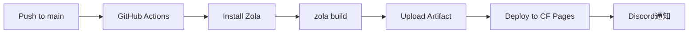

# 技術仕様書

## テクノロジースタック

### コア技術

| レイヤー | 技術 | バージョン/備考 |
|----------|------|-----------------|
| 静的サイトジェネレーター | Zola | Rust製、高速ビルド |
| テンプレートエンジン | Tera | Jinja2ライクな構文 |
| スタイルシート | SCSS/SASS | Zolaが自動コンパイル |
| マークアップ | Markdown | CommonMark準拠 |
| 数式レンダリング | KaTeX | v0.16.11（オプション） |

### インフラ・ホスティング

| サービス | 用途 |
|----------|------|
| GitHub | ソースコード管理 |
| GitHub Actions | CI/CD パイプライン |
| Cloudflare Pages | 静的サイトホスティング |

### 開発ツール

| ツール | 用途 |
|--------|------|
| Wrangler | Cloudflare CLI |
| npm | スクリプト実行（`npm run dev`） |

## ビルドプロセス

### ローカル開発

```bash
# 開発サーバー起動（ホットリロード対応）
zola serve
# → http://127.0.0.1:1111/

# 本番ビルド
zola build
# → public/ に出力
```

### CI/CD パイプライン



#### ワークフロー詳細

| ジョブ | 内容 | タイムアウト |
|--------|------|-------------|
| build | Zola インストール、ビルド、アーティファクトアップロード | 15分 |
| deploy | Cloudflare Pages へデプロイ | 10分 |
| notify | Discord へ結果通知 | 5分 |

#### トリガー条件

- `main` ブランチへの push
- Pull Request（フォーク以外）

#### 必要なシークレット

| シークレット | 用途 |
|-------------|------|
| `CLOUDFLARE_API_TOKEN` | Cloudflare API 認証 |
| `CLOUDFLARE_ACCOUNT_ID` | Cloudflare アカウント識別 |
| `DISCORD_WEBHOOK_URL` | Discord 通知 |

## 設定ファイル

### config.toml（Zola設定）

```toml
base_url = "https://blog.etak64n.dev/"
title = "etak64n's blog"
default_language = "ja"
generate_feeds = false          # フィード無効
generate_sitemap = true         # サイトマップ有効
build_search_index = false      # 検索インデックス無効（日本語未対応）
compile_sass = true             # SASS コンパイル有効

[markdown]
render_math = true               # 数式レンダリング有効
highlight_code = true            # コードハイライト有効
highlight_theme = "base16-ocean-dark"  # ハイライトテーマ

[[taxonomies]]
name = "tags"
render = true
paginate_by = 20

[[taxonomies]]
name = "categories"
render = true
paginate_by = 20
```

### wrangler.toml（Cloudflare設定）

```toml
name = "etak64n-blog"
pages_build_output_dir = "public"
compatibility_date = "2025-09-02"
```

## パフォーマンス要件

### ビルド性能

- Zola の高速ビルド（Rust製）を活用
- 増分ビルドによる開発時の高速リロード

### 配信性能

- Cloudflare のグローバルエッジネットワーク
- 静的ファイル配信による低レイテンシ
- キャッシュバスティング（`cachebust=true`）

### フロントエンド

- CSS はビルド時にコンパイル済み
- JavaScript は最小限（テーマ切り替え、モバイルメニュー）
- KaTeX は必要なページのみ遅延読み込み

## セキュリティ要件

### コンテンツセキュリティ

- 静的サイトのためサーバーサイド攻撃リスクなし
- 外部スクリプトは CDN（KaTeX）のみ

### デプロイセキュリティ

- GitHub Secrets による認証情報管理
- Cloudflare API トークンによる最小権限アクセス

## 技術的制約

| 制約 | 理由 |
|------|------|
| 検索機能なし | Zola の検索は日本語トークナイズ未対応 |
| RSS/Atom 無効 | 現時点で不要のため無効化 |
| コメント機能なし | 静的サイトのため外部サービス連携が必要 |

## 外部依存関係

| 依存先 | 用途 | URL |
|--------|------|-----|
| KaTeX CDN | 数式レンダリング | cdn.jsdelivr.net |
| GitHub Actions | CI/CD | github.com |
| Cloudflare Pages | ホスティング | pages.cloudflare.com |
