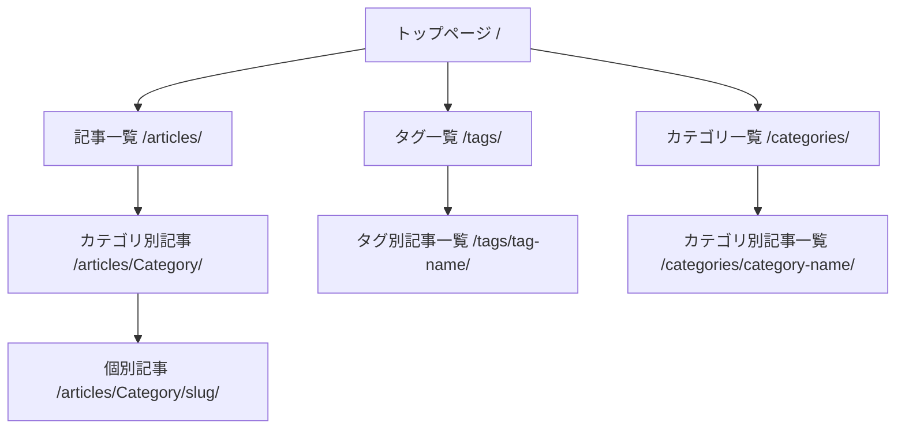

# 機能設計書

## システム構成図

```
┌─────────────────────────────────────────────────────────────────┐
│                        Cloudflare Pages                         │
│                    (エッジネットワーク配信)                      │
└─────────────────────────────────────────────────────────────────┘
                                ↑
                          デプロイ (public/)
                                │
┌─────────────────────────────────────────────────────────────────┐
│                       GitHub Actions                            │
│                     (CI/CD パイプライン)                        │
└─────────────────────────────────────────────────────────────────┘
                                ↑
                            push/merge
                                │
┌─────────────────────────────────────────────────────────────────┐
│                      GitHub Repository                          │
│                   (ソースコード管理)                            │
└─────────────────────────────────────────────────────────────────┘
                                ↑
                          zola build
                                │
┌─────────────────────────────────────────────────────────────────┐
│                          Zola                                   │
│                   (静的サイトジェネレーター)                    │
│  ┌──────────┐  ┌──────────┐  ┌──────────┐  ┌──────────┐        │
│  │ content/ │  │templates/│  │  sass/   │  │ static/  │        │
│  │(Markdown)│  │  (Tera)  │  │ (SCSS)   │  │ (assets) │        │
│  └──────────┘  └──────────┘  └──────────┘  └──────────┘        │
└─────────────────────────────────────────────────────────────────┘
```

## ページ構成

### サイトマップ



### ページ一覧

| ページ | パス | テンプレート |
|--------|------|--------------|
| トップページ | `/` | `index.html` |
| 記事一覧 | `/articles/` | `articles/list.html` |
| 個別記事 | `/articles/{category}/{slug}/` | `articles/single.html` |
| タグ一覧 | `/tags/` | `taxonomy_list.html` |
| タグ別記事 | `/tags/{tag}/` | `taxonomy_single.html` |
| カテゴリ一覧 | `/categories/` | `taxonomy_list.html` |
| カテゴリ別記事 | `/categories/{category}/` | `taxonomy_single.html` |

## テンプレート設計

### テンプレート階層

```
templates/
├── base.html              # 共通レイアウト（ヘッダー、フッター、ナビ）
├── index.html             # トップページ
├── taxonomy_list.html     # タクソノミー一覧
├── taxonomy_single.html   # タクソノミー詳細
├── articles/
│   ├── list.html          # 記事一覧
│   └── single.html        # 個別記事（目次、関連記事含む）
└── shortcodes/
    ├── code.html          # コードブロック
    ├── codebox.html       # コードボックス
    ├── img.html           # 画像埋め込み
    ├── link.html          # リンクカード
    ├── note.html          # 注釈ボックス
    └── ref.html           # 参照リンク
```

### base.html コンポーネント構成

```
┌─────────────────────────────────────────────────────────┐
│ <header>                                                │
│   ┌─────────┐  ┌──────────────────────┐  ┌───────────┐ │
│   │ハンバーガー│  │      ブランド名       │  │ナビ＋テーマ│ │
│   │  メニュー  │  │   etak64n's blog    │  │  切替     │ │
│   └─────────┘  └──────────────────────┘  └───────────┘ │
└─────────────────────────────────────────────────────────┘
┌─────────────────────────────────────────────────────────┐
│ <nav id="mobile-nav">（モバイル時のみ表示）             │
│   Articles | Tags | Categories                          │
└─────────────────────────────────────────────────────────┘
┌─────────────────────────────────────────────────────────┐
│ <main>                                                  │
│                        │
└─────────────────────────────────────────────────────────┘
┌─────────────────────────────────────────────────────────┐
│ <footer>                                                │
│   © 2025 etak64n                                        │
└─────────────────────────────────────────────────────────┘
```

### 個別記事ページ（single.html）レイアウト

```
┌─────────────────────────────────────────────────────────────┐
│                         Header                              │
├─────────────────────────────────────────────────────────────┤
│                                                             │
│  ┌──────────────────────────────────────────────────────┐  │
│  │                   Hero Image                          │  │
│  └──────────────────────────────────────────────────────┘  │
│                                                             │
│  ┌────────────┐  ┌──────────────────────────────────────┐  │
│  │            │  │           Article Title              │  │
│  │    ToC     │  │           Date / Updated             │  │
│  │  (sticky)  │  │           Tags                       │  │
│  │            │  ├──────────────────────────────────────┤  │
│  │  - 見出し1  │  │                                      │  │
│  │  - 見出し2  │  │           Article Body               │  │
│  │    - 2.1   │  │                                      │  │
│  │    - 2.2   │  │                                      │  │
│  │  - 見出し3  │  │                                      │  │
│  │            │  │                                      │  │
│  └────────────┘  └──────────────────────────────────────┘  │
│                                                             │
│  ┌──────────────────────────────────────────────────────┐  │
│  │                  Related Posts                        │  │
│  │  ┌──────┐  ┌──────┐  ┌──────┐                        │  │
│  │  │Card 1│  │Card 2│  │Card 3│                        │  │
│  │  └──────┘  └──────┘  └──────┘                        │  │
│  └──────────────────────────────────────────────────────┘  │
│                                                             │
├─────────────────────────────────────────────────────────────┤
│                         Footer                              │
└─────────────────────────────────────────────────────────────┘
```

## データモデル

### 記事（Page）フロントマター

```toml
+++
title = "記事タイトル"           # 必須: 記事のタイトル
date = 2025-01-01               # 必須: 公開日
updated = 2025-01-15            # 任意: 更新日
draft = false                   # 任意: 下書きフラグ（デフォルト: false）

[taxonomies]
tags = ["Tag1", "Tag2"]         # 任意: タグ配列
categories = ["Category"]       # 任意: カテゴリ配列

[extra]
hero = "/images/hero.webp"      # 任意: ヒーロー画像パス
toc = true                      # 任意: 目次表示フラグ
math = false                    # 任意: 数式レンダリング（KaTeX）
+++
```

### カテゴリセクション（_index.md）

```toml
+++
title = "CategoryName"
transparent = true              # 親セクションに記事を透過表示
+++
```

## ショートコード仕様

### img（画像埋め込み）

```markdown
{{ img(src="image.webp", alt="説明", caption="キャプション") }}
```

| パラメータ | 必須 | 説明 |
|-----------|------|------|
| src | Yes | 画像パス |
| alt | No | 代替テキスト |
| caption | No | キャプション |

### link（リンクカード）

```markdown
{{ link(url="https://example.com", title="タイトル") }}
```

### note（注釈ボックス）

```markdown
{{ note(type="info") }}
注釈内容
{{ end }}
```

| type | 表示 |
|------|------|
| info | 情報 |
| warning | 警告 |
| tip | ヒント |

### code / codebox（コードブロック）

ファイル名付きコードブロックの表示。

### ref（参照リンク）

参照用のリンク表示。

## UI/UX 設計

### テーマ切り替え

- ライトモード / ダークモードの切り替えをサポート
- OS のシステム設定を自動検出
- ユーザー選択を localStorage に保存
- FOUC（Flash of Unstyled Content）防止のため、head 内で早期適用

### レスポンシブ対応

| ブレークポイント | 対応 |
|-----------------|------|
| デスクトップ | 通常ナビゲーション表示 |
| モバイル | ハンバーガーメニュー表示 |

### アクセシビリティ

- セマンティックHTML使用
- ARIA属性の適切な設定（aria-label, aria-expanded 等）
- キーボードナビゲーション対応
